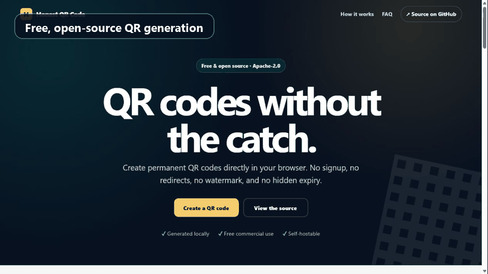

# Honest QR Code

[](https://honestqrcode.com/)
[](LICENSE)
[](#run-locally)

Free, open-source QR code generation that runs entirely in your browser.

[Use the live generator](https://honestqrcode.com/) · [Report a bug](https://github.com/Mizaro/honestqrcode/issues/new?template=bug_report.yml) · [Request a feature](https://github.com/Mizaro/honestqrcode/issues/new?template=feature_request.yml)



[Watch the lightweight MP4 demo](assets/demo.mp4) · [View the full-size screenshot](assets/screenshot.png)

## Why this project exists

Many QR services advertise a free code but route scans through a server they control. Honest QR Code creates static codes: the destination is stored directly in the image, so the generated code does not depend on this project, an account, or a subscription.

The implementation is deliberately plain HTML, CSS, and JavaScript. There are no runtime dependencies, cookies, trackers, API calls, accounts, or build tools.

## Features

- Website, WiFi, WhatsApp, contact, email, SMS, phone, text, location, calendar, Skype, Zoom, PayPal, Bitcoin, PDF, image, video, and social-profile QR codes
- PNG, JPG, and SVG exports
- Custom colors, gradients, module styles, logo overlay, captions, sizes, and error-correction levels
- Responsive and keyboard-accessible interface
- Client-side generation with no QR payload upload
- Free commercial use and self-hosting under Apache-2.0

## Run locally

No installation or build is required. Clone the repository and serve the directory:

```bash
git clone https://github.com/Mizaro/honestqrcode.git
cd honestqrcode
python -m http.server 8080
```

Open <http://localhost:8080>. Opening `index.html` directly also works for the generator, although a local server more closely matches production behavior.

Run the dependency-free structural validation with:

```bash
python tests/validate_site.py
node --check app.js
```

## Deploy

Upload the repository contents to the document root of any static host. The production deployment mirrors `main` into Hostinger's `public_html` directory.

The included `.htaccess` provides the canonical HTTPS redirect, security headers, compression, caching, and the custom 404 page on Apache-compatible hosting. If your host does not support `.htaccess`, reproduce those settings in its platform configuration.

## Privacy and security model

The app has no network-generation path: its content is converted to a QR matrix in the current browser. The production Content Security Policy also sets `connect-src 'none'`.

Normal hosting or CDN access logs may still contain ordinary request information such as IP addresses and user agents. See [SECURITY.md](SECURITY.md) for vulnerability reporting.

## Project structure

```text
.
├── index.html              Main generator and landing page
├── app.js                  Generator behavior and export logic
├── qrcode-matrix.js        Vendored QR encoding engine
├── styles.css              Shared site styles
├── assets/                 Branding and demo media
├── */index.html            Focused, indexable use-case guides
├── robots.txt
├── sitemap.xml
└── .htaccess               Hostinger/Apache production settings
```

## Contributing

Issues and focused pull requests are welcome. Please read [CONTRIBUTING.md](CONTRIBUTING.md) first. Keep the app dependency-free and preserve its privacy model.

## License

Honest QR Code is licensed under the [Apache License 2.0](LICENSE). The vendored QR encoder has its own MIT notice; see [THIRD_PARTY_NOTICES.md](THIRD_PARTY_NOTICES.md).
